# Online Asset Devtest - Bintang Ramadhana Faturizky

## **Description**

This project is a simple full-stack dashboard with **User** and **Product** management.
The frontend uses **Vue 3 + TailwindCSS + DaisyUI + TanStack Query + Form Handling (VeeValidate + Yup)**, while the backend uses **Node.js + Express + Sequelize + PostgreSQL**.
The database is automatically seeded when the server starts for the first time.

---

## **Libraries Used**

### **Client**

- Vue 3 (core framework)
- Vue Router (page routing)
- TailwindCSS (utility-first CSS)
- DaisyUI (Tailwind-based UI components)
- Axios (HTTP client)
- TanStack Query (data fetching and state management)
- Vee-Validate + Yup (form validation)

**Dev Dependencies:**

- Vite (build tool and dev server)
- @vitejs/plugin-vue (Vue plugin for Vite)
- @tailwindcss/vite (Tailwind integration for Vite)

---

### **Server**

- Express (web framework)
- Sequelize (ORM for PostgreSQL)
- pg (PostgreSQL driver)
- dotenv (load environment variables)
- cors (allows client requests)
- nodemon (auto reload dev server)

---

## **Environment Variables**

### **Client (.env)**

```
VITE_API_BASE_URL=http://localhost:3000/api
```

### **Server (.env)**

```
DB_HOST=db
DB_USER=postgres
DB_PASS=postgres
DB_NAME=dashboard
PORT=3000
NODE_ENV=development
```

---

## **How to Run the Project**

1. **Clone the repository**

```bash
git clone <repo-url>
cd <project-root>
```

2. **Start all containers using Docker**

```bash
docker-compose up --build
```

- The PostgreSQL **database** starts automatically.
- The **server** seeds the database and runs the API on port 3000.
- The **client** Vite dev server runs on port 5173 with hot reload.

3. **Access the application**

- Dashboard: `http://localhost:5173`
- API server: `http://localhost:3000/api/users` or `/api/products`

---

## **Screenshot**

**Home Page:**
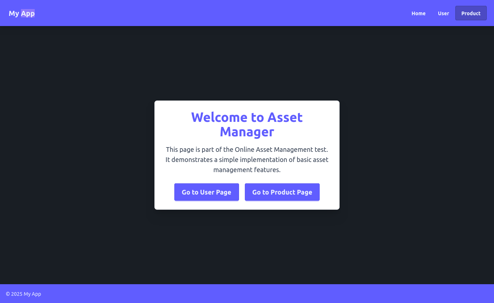

**User Page:**

#### User Table

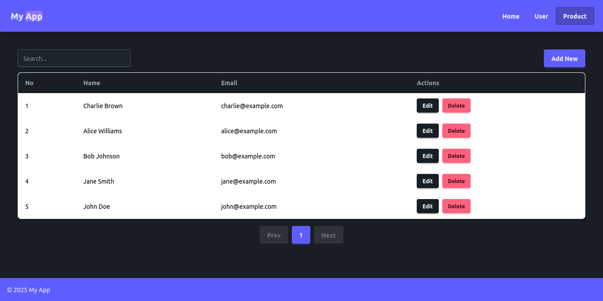

#### Create User

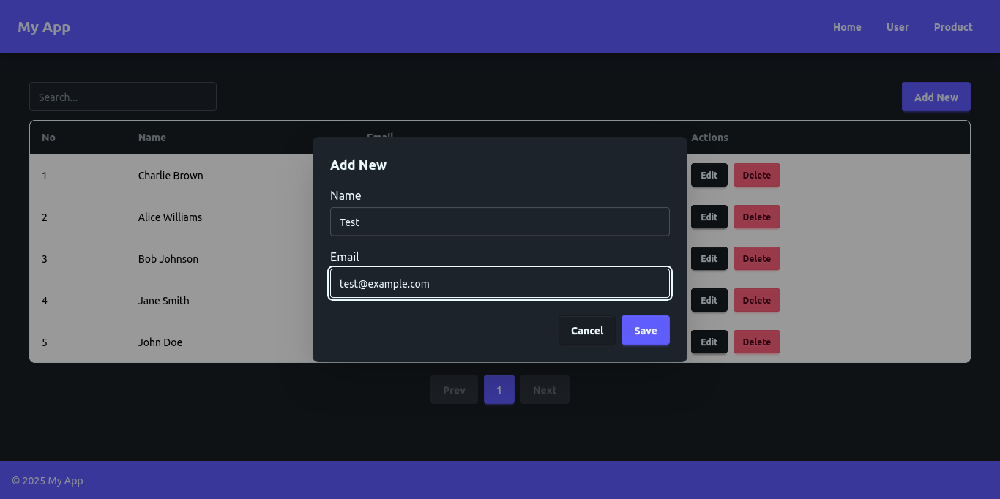

#### Edit User


#### Delete User

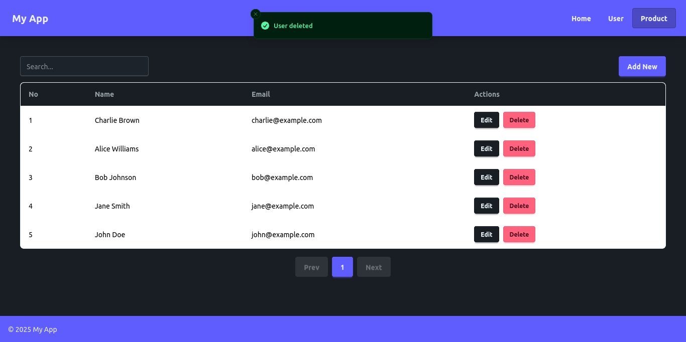

#### Search User

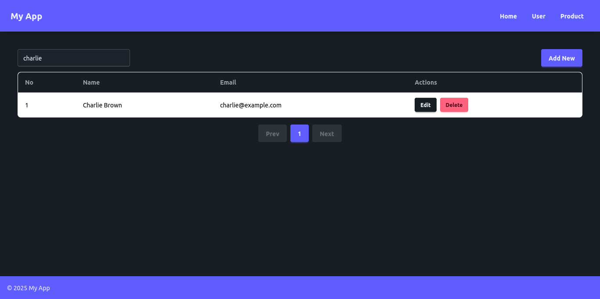

#### Sort User

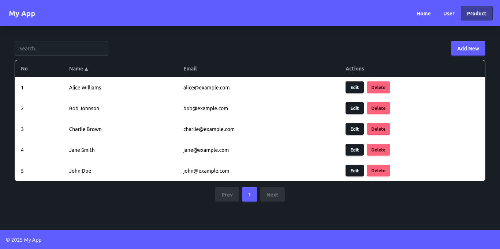

**Product Page:**

#### Product Table

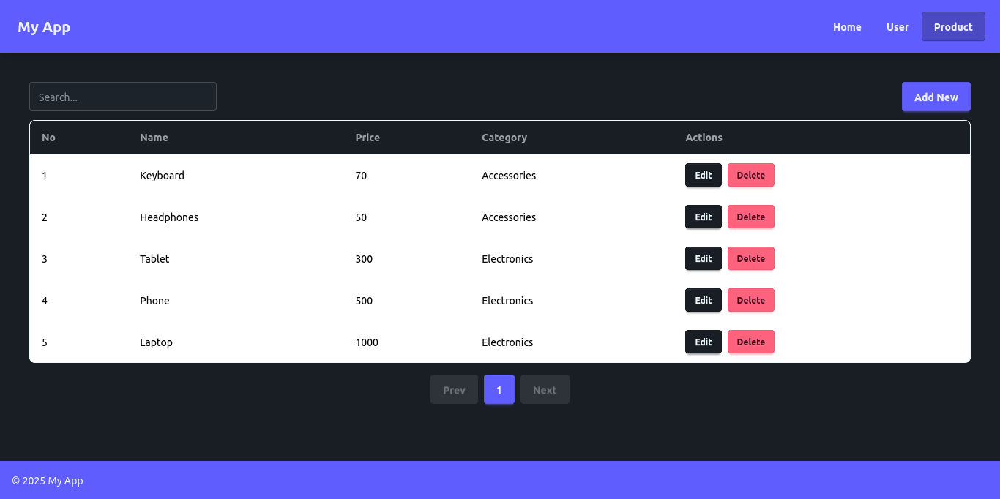

#### Create Product

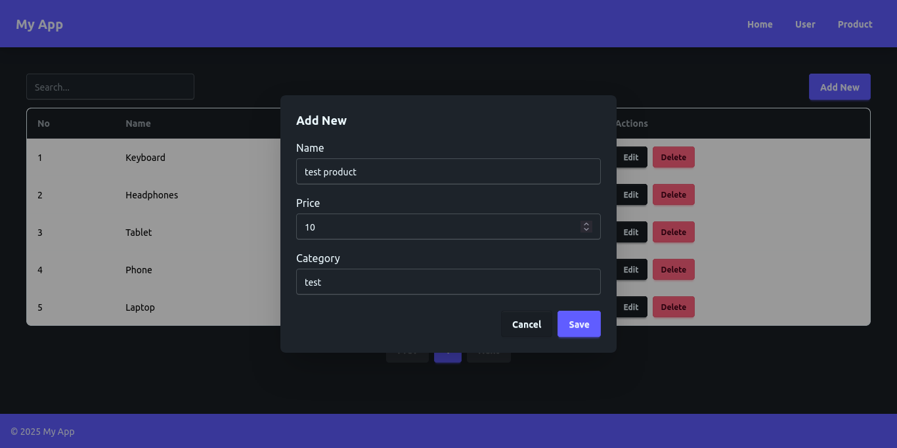

#### Edit Product

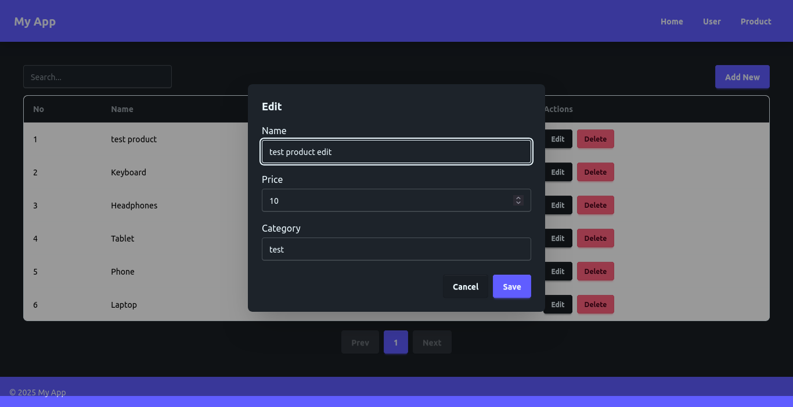

#### Delete Product

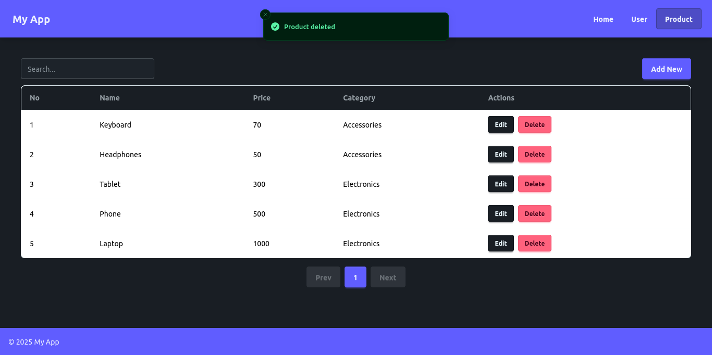

#### Search Product

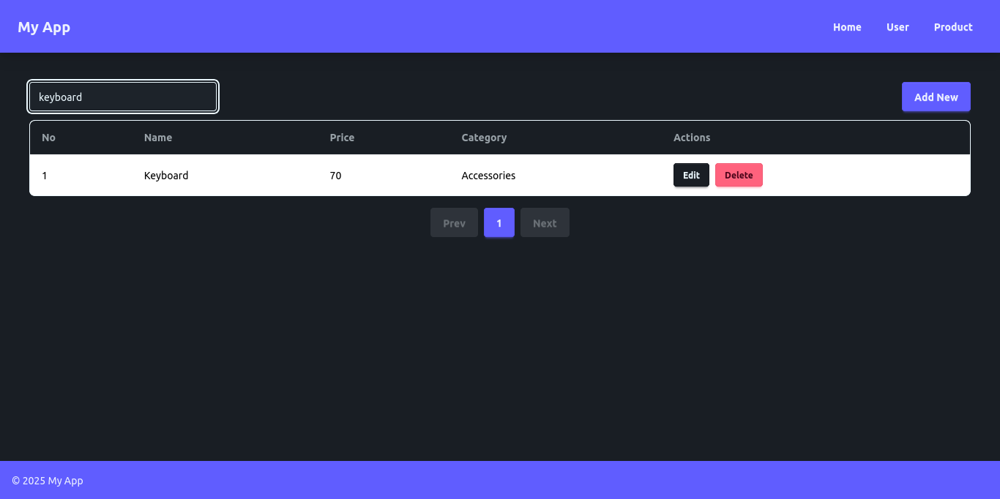

#### Sort Product

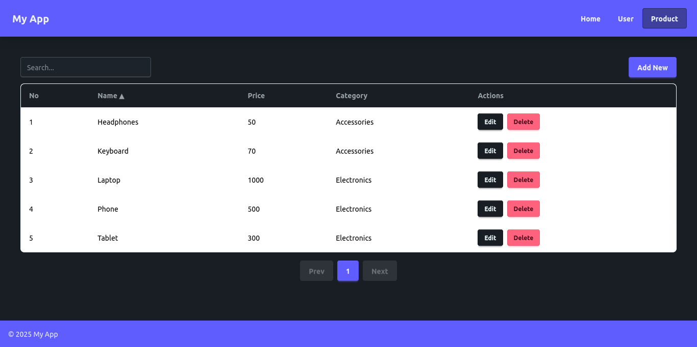
